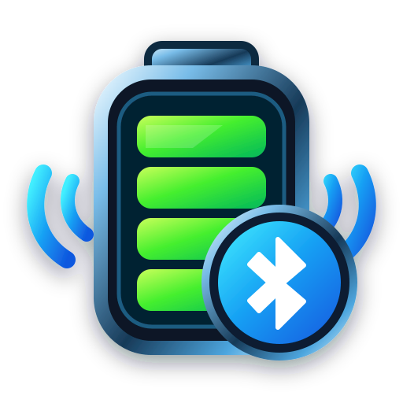

<p align="center">
  
</p>

# Porcentaje de batería

Aplicación de Windows en Python para ver el nivel de batería y el estado de carga de periféricos conectados por Bluetooth o receptores USB propietarios.

## Soporte actual

- **Razer DeathAdder V2 Pro (dongle 2.4 GHz)**: porcentaje y consulta de estado de carga por HID (`1532:007D`).
- **Logitech G935 Gaming Headset**: porcentaje por el receptor `046D:0A87`; estado **Cargando** también detectado mediante la interfaz USB de carga `046D:0A88`.
- **Redragon Fizz Pro K616 por Bluetooth**: Windows puede exponerlo como `BT5.0 KB`; la app lo identifica como Redragon y muestra el porcentaje BLE publicado por Windows.
- **Redragon Fizz Pro K616 por dongle 2.4 GHz**: receptor `25A7:FA70` detectado; el dongle no expone un porcentaje conocido.
- **JBL GO Essential**: se detecta como Bluetooth, pero Windows no expone porcentaje de batería para este modelo.
- **Bluetooth genérico**: usa la propiedad de batería publicada por Windows cuando el dispositivo la expone.

## Funciones

- Pestañas **Mis dispositivos** y **Todos los dispositivos**.
- Selección persistente de los dispositivos que querés ver en la pantalla principal y en la bandeja.
- Bandeja del sistema con porcentaje y estado de los dispositivos seleccionados.
- Inicio con Windows, minimizado en bandeja.
- Actualizador automático con timeout y recuperación si GitHub no responde.
- Exportación de diagnóstico HID/Bluetooth.
- Iconos propios multirresolución para ejecutable, barra de tareas, menú Inicio, bandeja e instalador.
- GitHub Actions compila `PorcentajeBateria.exe`, crea el instalador Inno Setup y publica Releases.

## Desarrollo

```powershell
py -m venv .venv
.\.venv\Scripts\Activate.ps1
pip install -r requirements.txt
python build_icons.py
python app.py
```

## Crear una nueva versión

1. Cambiar `APP_VERSION` en `version.py`.
2. Hacer push a `main`.
3. GitHub Actions genera los iconos, compila el ejecutable, crea el instalador y publica el nuevo Release.

## Nota sobre batería

Bluetooth estándar puede exponer el porcentaje directamente a Windows. Los receptores 2.4 GHz no tienen un estándar universal: cada fabricante puede requerir un protocolo HID propio o no exponer el porcentaje en absoluto.
